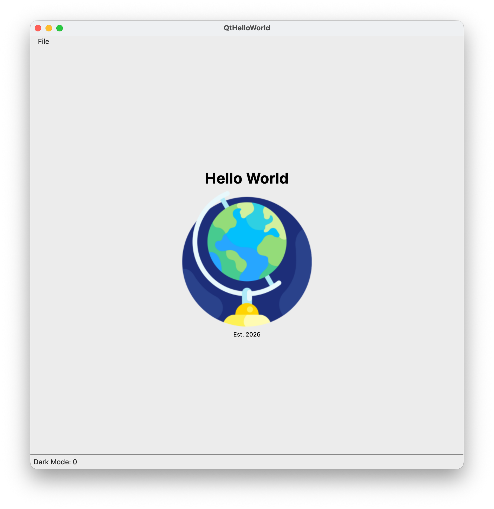
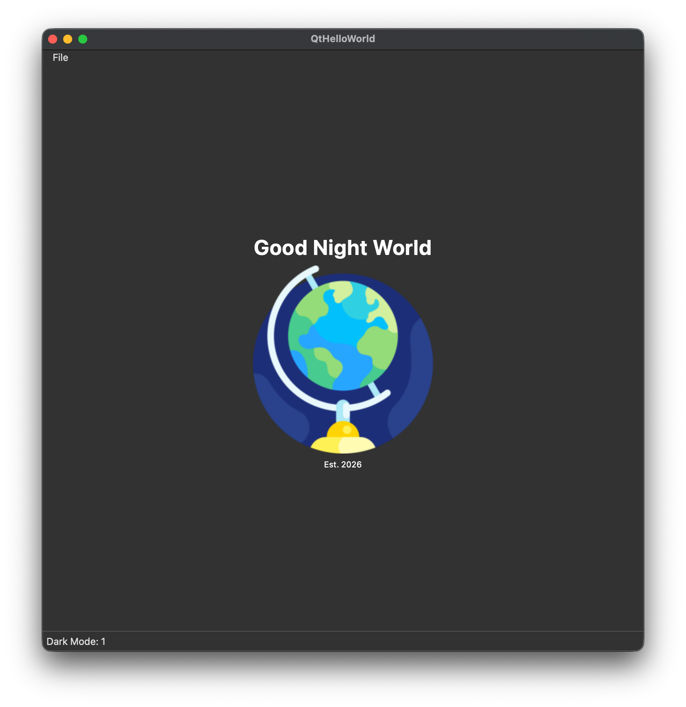

# QtHelloWorld
Simple QT app to print "Hello World".


## To build:
1. cmake -S . -B build
2. cmake --build build

## To run:
1. cd build/bin
2. Run the built executable from the build directory and choose the UI backend:

```
./QtHelloWorld qml
or
./QtHelloWorld qwidget
```

The first starts the QML-based UI; the second starts the QWidget-based UI. If CMake put the binary in a subdirectory (for example build/bin), run the executable from that location.

## Screenshots
<figure style="text-align: center;">
    
    <figcaption>QWidget — Light Mode</figcaption>
</figure>

<figure style="text-align: center;">
    
    <figcaption>QWidget — Dark Mode</figcaption>
</figure>

<figure style="text-align: center;">
    
    <figcaption>QML — Light Mode</figcaption>
</figure>

<figure style="text-align: center;">
    
    <figcaption>QML — Dark Mode</figcaption>
</figure>

## Additional Notes
### Including MainWindow.h when registing files with target
Best practice for Qt projects: always list headers that contain Q_OBJECT.
Q_OBJECT must be processed by the MOC. If the MOC does not run, we'll see linker
errors. CMake’s AUTOMOC cannot process what it does not see.
